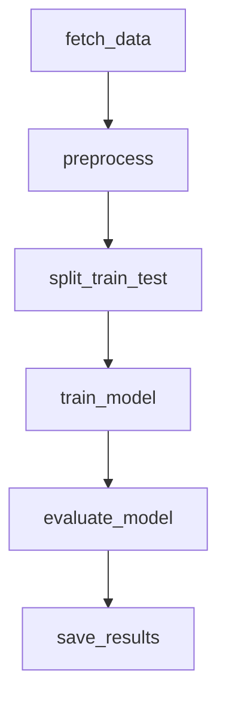
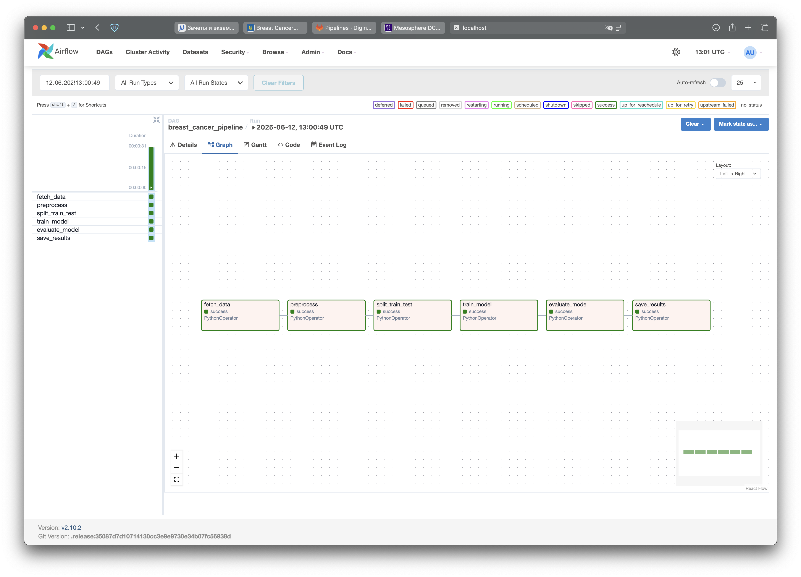

# Автоматизированный ML‑пайплайн для диагностики рака груди

## Цель проекта  
Создать **воспроизводимый, полностью автоматизированный ETL и ML‑пайплайн**, который загружает датасет *Breast Cancer Wisconsin (Diagnostic)*, выполняет предобработку, обучает классификатор Logistic Regression, оценивает метрики и сохраняет модель с отчётами в локальное хранилище — всё это оркестрируется **Apache Airflow**.

---

## ML‑задача
* **Тип задачи:** бинарная классификация  
* **Целевая переменная:** `diagnosis` — *злокачественная (M)* vs *доброкачественная (B)*  
* **Признаки:** 30 числовых характеристик ядер клеток, извлечённых из FNA‑изображений  
* **Ключевые метрики:** Accuracy, Precision, Recall, F1‑score  
  *(дисбаланс классов умеренный, поэтому особенно важны Precision и Recall для злокачественного класса)*

---

## Обзор пайплайна

Пайплайн разбит на шесть модульных стадий, каждая из которых соответствует задаче в DAG Airflow:

| Stage ID            | Назначение                                             | Входы              | Выходы                          |
|---------------------|--------------------------------------------------------|--------------------|---------------------------------|
| `fetch_data`        | Скачивание исходного CSV                               | Удалённый URL      | `raw/breast_cancer.csv`         |
| `preprocess`        | Очистка, переименование колонок, обработка пропусков, масштабирование | CSV после валидации | `processed/data.parquet`        |
| `split_train_test`  | Стратифицированный сплит train/val/test (70/15/15 %)   | Обработанные данные| 3 Parquet‑файла                 |
| `train_model`       | Обучение LogisticRegression (GridSearchCV)             | Train + Val        | `model.pkl`                     |
| `evaluate_model`    | Оценка метрик на тесте                                 | Модель и Test      | `metrics.json`, cls‑report      |
| `save_results`      | Сохранение артефактов в `results/`                     | Артефакты + метрики| Файлы в `results/` + `manifest.json` |

*Каждый этап реализован отдельным Python‑скриптом в `etl/`, который можно запускать автономно или через `PythonOperator`. Параметры передаются через YAML/ENV, что обеспечивает воспроизводимость.*

---

## Диаграмма пайплайна



*На каждом шаге настроены механизмы надёжности: ретраи, алерты, таймауты.*

---

## Краткое описание шагов
* **fetch_data:** Загружает датасет; 3 повторные попытки при сетевых ошибках, проверка контрольной суммы.  
* **preprocess:** Удаляет `id`, маппит метки в 0/1, импутирует (<1 %) медианой, масштабирует `StandardScaler`.  
* **split_train_test:** Стратифицированный `train_test_split(..., stratify=y, random_state)`.  
* **train_model:** Logistic Regression (`saga`, `class_weight='balanced'`); подбор *C* через GridSearchCV.  
* **evaluate_model:** Считает метрики; если ухудшились — `AirflowSkipException`.  
* **save_results:** Копирует артефакты в `results/`, создаёт `manifest.json`.  

---

## Скрипты и соответствие DAG

| Задача DAG (Stage ID) | Путь к скрипту            | Ответственность                                                    | Upstream → Downstream |
|-----------------------|---------------------------|--------------------------------------------------------------------|-----------------------|
| **fetch_data**        | `etl/fetch_data.py`       | Скачивание через **ucimlrepo**, снимок данных, сохраняет CSV       | – → preprocess        |
| **preprocess**        | `etl/preprocess.py`       | Очистка, *snake_case*, кодирование меток, импутация, масштабирование| fetch_data → split_train_test |
| **split_train_test**  | `etl/split_train_test.py` | Сплит 70/15/15 → Parquet‑файлы                                     | preprocess → train_model |
| **train_model**       | `etl/train_model.py`      | Grid‑search LogisticRegression; сохраняет модель                   | split_train_test → evaluate_model |
| **evaluate_model**    | `etl/evaluate_model.py`   | Метрики на тесте; пишет JSON/CSV                                   | train_model → save_results |
| **save_results**      | `etl/save_results.py`     | Копирует артефакты в `results/`, пишет `manifest.json`             | evaluate_model → end  |

---

## Архитектурные решения

* **Airflow** выбран как оркестратор, т.к. даёт декларативное описание зависимостей, встроенные ретраи, мониторинг и расширяемость (можно перейти на Celery/KubernetesExecutor без переписывания кода).
* **Линейная топология** пайплайна (последовательность задач) упрощает отладку; каждая стадия пишет собственные артефакты, что обеспечивает идемпотентность и позволяет переиспользовать шаги.
* **Parquet + PyArrow** для промежуточных данных — компактно, колоночный формат ускоряет чтение / запись, легко переносится между Python‑экосистемой и Spark/Trino.
* **Logistic Regression** как базовая интерпретируемая модель: быстрая, даёт приемлемое качество и является эталоном для последующего A/B‑сравнения с более сложными моделями.
* **ENV‑конфигурация** вместо хардкода путей — один и тот же код запускается локально, в CI и на прод‑сервере без правок.

---

## Идеи / дальнейшее развитие

1. **MLflow / Model Registry** — автоматическая версия моделей, хранение метрик и артефактов, возможность отката.
2. **Great Expectations** — декларативная валидация схемы и статистики данных вместо ручных assert‑ов.
3. **Docker + KubernetesExecutor** — контейнеризация и горизонтальное масштабирование тасков без изменения DAG.
4. **Мониторинг дрейфа** (Evidently AI) и авто‑алерты в Slack при ухудшении качества в продакшене.
5. **CI/CD (GitHub Actions)**: линтер, unit‑тесты ETL, автоматический деплой DAG в Airflow через Helm Chart.
6. **Cloud Storage Integration** — добавление задачи загрузки артефактов в S3/GCS для промышленного использования.

---

## Интеграция с хранилищем

Пайплайн сохраняет артефакты **локально**. Директория регулируется переменными окружения.

| Переменная | Назначение                                  | Значение по умолчанию | Пример |
|------------|---------------------------------------------|-----------------------|--------|
| `RESULTS_DIR` | Куда кладутся артефакты (`save_results`) | `./results/`          | `/mnt/shared/ml_results` |
| `PIPELINE_SCHEDULE` | Переопределяет cron‑выражение       | `None` (ручной запуск) | `@daily` |

**Как сохраняется**

```text
results/
├── model.pkl                     # сериализованная LogisticRegression
├── test_metrics.json             # accuracy / precision / recall / f1
├── classification_report.csv     # отчёт sklearn
└── manifest.json                 # карта логических имён
```

*`save_results.py` копирует файлы; флаг `--move` удаляет исходники, `--timestamp` версионирует имена.*

---

## Airflow DAG и запуск



### Быстрый старт

```bash
# 1. Активировать окружение
conda activate bc_pipeline
pip install -r requirements.txt

# 2. Экспорт переменных (один раз)
export AIRFLOW_HOME=$PWD/.airflow
export AIRFLOW__CORE__DAGS_FOLDER=$PWD/dags
export RESULTS_DIR=$PWD/results

# 3. Инициализировать Airflow
airflow db init
airflow users create -u admin -p admin -r Admin -e admin@local -f Admin -l User

# 4. Запустить сервисы
airflow webserver -p 8080          # терминал 1
airflow scheduler                  # терминал 2

# 5. Запустить пайплайн вручную
airflow dags trigger breast_cancer_pipeline

# 6. Тест конкретного шага
airflow tasks test breast_cancer_pipeline preprocess 2025-06-12
```